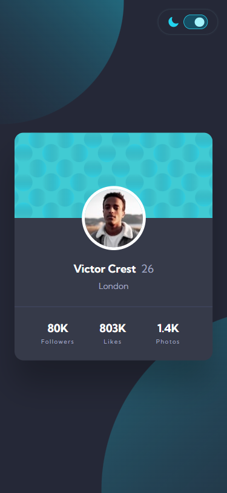

# Profile Card Component

## A Responsive Profile Card Component of Victor Crest

| _Mobile Preview (375x812)_                                   | _Desktop Preview (1440x960)_                                    |
| ------------------------------------------------------------ | --------------------------------------------------------------- |
|       |       |
|  |  |

A clean, responsive profile card featuring Victor Crest’s basic profile and social stats. The layout adjusts beautifully from mobile to desktop view and includes support for dark mode using CSS custom properties and JavaScript.

Created as part of the building challenges from **[Frontend Mentor](https://www.frontendmentor.io/)**.

---

## Overview

This project is a responsive and accessible profile card component. It includes dynamic theme toggling (light/dark mode) that respects user preferences and saves them using `localStorage`. The layout uses mobile-first principles with `clamp()` for fluid scaling and media queries to ensure good visuals across various screen sizes.

The project highlights semantic HTML, consistent styling using CSS variables, and minimal JavaScript used solely for theme switching and background pattern changes.

---

## Features

- Responsive layout using mobile-first design
- Dark mode toggle using `localStorage`
- Accessible markup with skip link and ARIA support
- Optimized for smooth transitions with `prefers-reduced-motion` support
- Fully semantic HTML structure
- Custom background patterns that change with theme
- Performance-audited using Lighthouse
- CSS `clamp()` used for adaptive sizing with online calculator assistance

---

## What I Learned

- How to build fluid layouts using `clamp()` with real calculated values with the help from **[The Clamp Calculator](https://royalfig.github.io/fluid-typography-calculator/)**
- Enhancing images and outlines for hover states using CSS transitions
- Layering background images effectively with `z-index`
- Working with responsive background SVG positioning

---

## Tech Used

- HTML5
- CSS3
- JavaScript (minimal)
- Git
- GitHub
- Netlify

---

## Design Reference & Tools

- JPG design image
- PerfectPixel

---

## How to Run

1. Clone the repository
2. Open `index.html` in your browser

---

## Live Demo

Or you can check out the **[live website here](https://profile-card-component-fm-jiro.netlify.app/)**

---

## Performance Report

A **Google Lighthouse** audit was conducted on the final version of this project. You can view the **[full report here](./assets/downloads/lighthouse-performance-report.pdf)**.

---

## Author

Created by **Elmar Chavez**

Month/Year: **July 2025**

Journey: **4th** month of learning _frontend web development_.
